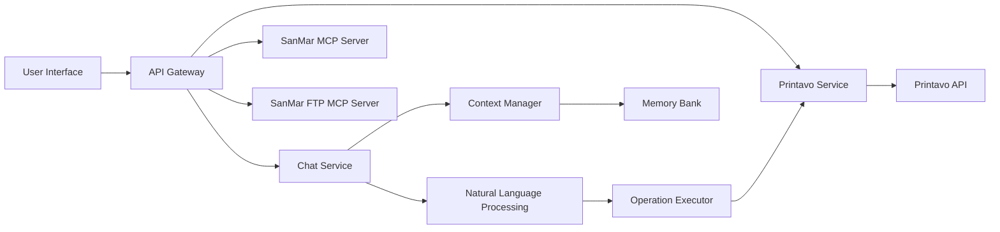
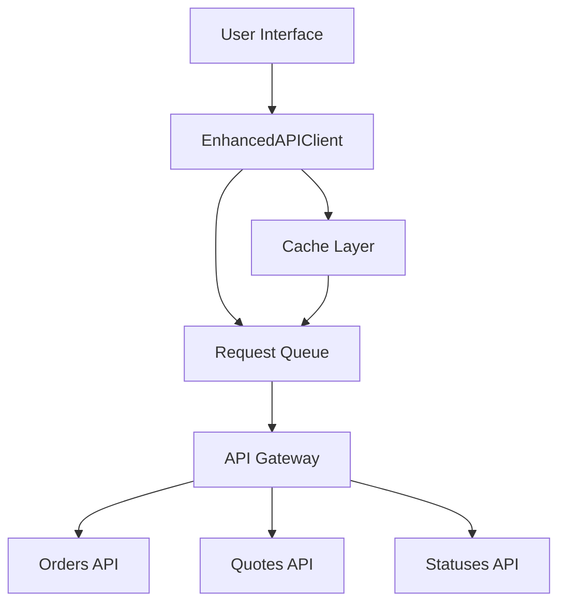
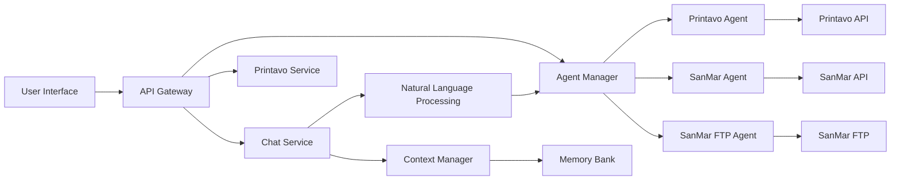
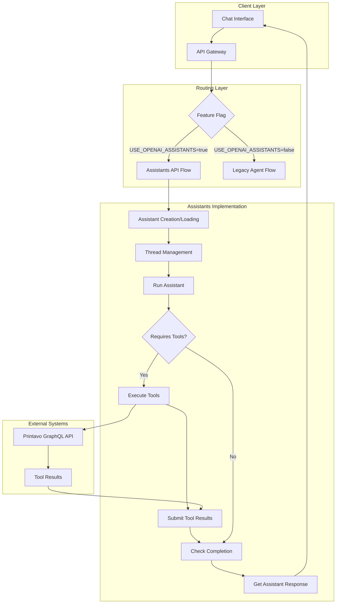

# System Patterns: Printavo Chat Application

**Architecture:**
The Printavo Chat application follows a layered architecture, with distinct components responsible for different aspects of the system.



**Components:**

1.  **User Interface (UI):**
    -   React-based web interface for user interaction.
    -   Handles chat input and output display.
    -   Communicates with the API Gateway.

2.  **API Gateway:**
    -   Next.js API routes for handling requests from the UI.
    -   Routes requests to appropriate backend services.
    -   Handles authentication and authorization.

3.  **Chat Service:**
    -   Core logic for chat functionality.
    -   Manages conversation flow and state.
    -   Integrates with NLP and Context Manager.

4.  **Natural Language Processing (NLP):**
    -   OpenAI API for natural language understanding.
    -   Processes user messages to identify intent and extract parameters.
    -   Translates natural language queries into structured operations.

5.  **Context Manager:**
    -   Manages conversation context and history.
    -   Stores and retrieves relevant context for each conversation.
    -   Improves NLP accuracy by providing context.

6.  **Printavo Service:**
    -   Abstraction layer for interacting with the Printavo API.
    -   Encapsulates Printavo API calls and data handling.
    -   Provides functions for common Printavo operations.

7.  **Operation Executor:**
    -   Executes operations based on NLP output.
    -   Calls Printavo Service to perform actions.
    -   Formats responses for the Chat Service.

8.  **Memory Bank:**
    -   Stores project-related documentation and context.
    -   Provides persistent storage for system knowledge.
    -   Used for documentation and context retrieval.

9.  **SanMar MCP Server:**
    -   External MCP server providing tools for SanMar API interaction.
    -   Communicates via SOAP with SanMar's Standard and PromoStandards APIs.
    -   Accessed via the API Gateway using `use_mcp_tool`.
    -   Integrated into `lib/chat-commands.ts` (`addLineItemToQuote`) to fetch product details (name, description) based on style number during quote creation.

10. **SanMar FTP MCP Server:**
    -   External MCP server for downloading files from the SanMar FTP server.
    -   Uses SFTP to retrieve data files.
    -   Accessed via the API Gateway using `use_mcp_tool`.

9.  **SanMar MCP Server:**
    -   External MCP server providing tools for SanMar API interaction.
    -   Communicates via SOAP with SanMar's Standard and PromoStandards APIs.
    -   Accessed via the API Gateway using `use_mcp_tool`.

**Design Patterns:**

-   **API Gateway:** Central point of entry for all API requests.
-   **Backend for Frontend (BFF):** API Gateway tailored for the UI needs.
-   **Service Abstraction:** Printavo Service isolates the application from Printavo API specifics.
-   **Strategy Pattern:** Operation Executor uses different strategies for different operations.
-   **Context Pattern:** Context Manager provides conversational context to NLP and other services.

**Key Technical Decisions:**

-   **Next.js:** Full-stack framework for UI and API development.
-   **OpenAI API:** NLP engine for natural language understanding.
-   **Printavo API:** Integration with Printavo for data access.
-   **TypeScript:** Language for type safety and maintainability.
-   **Markdown:** Format for memory bank documentation.

**API Layer Architecture:**



**Enhanced API Client Features:**
- Request Queuing:
  - Intelligent queue management
  - Rate limit handling
  - Request staggering
  - Exponential backoff
- Caching:
  - TTL-based caching
  - Cache invalidation
  - Memory optimization
- Fallback Mechanisms:
  - Multiple endpoint attempts
  - Graceful degradation
  - Error recovery
- Error Handling:
  - Error classification
  - Retry strategies
  - Comprehensive logging

**API Design Patterns:**
- Singleton Pattern: Used for EnhancedAPIClient and service instances
- Queue Pattern: For managing API request flow
- Strategy Pattern: For different API endpoints and fallback strategies
- Observer Pattern: For cache invalidation and updates
- Factory Pattern: For creating API requests
- Adapter Pattern: For normalizing API responses

**Key Technical Decisions:**
- Implemented request queuing to prevent rate limiting
- Added staggered requests with configurable delays
- Enhanced caching with TTL support
- Created dedicated API services for better separation of concerns
- Added comprehensive logging for debugging
- Implemented intelligent retry logic

# Recursive Data Extraction Pattern

When dealing with complex nested data structures from external APIs, we use a recursive extraction pattern to flatten and simplify the data. This is particularly useful for Printavo's nested line item groups and line items.

```typescript
function extractAllLineItems(data: any): any[] {
  if (!data) return [];
  
  let allLineItems: any[] = [];
  
  // Function to recursively extract items
  const extractItems = (node: any) => {
    // Handle direct line items
    if (node.lineItems?.edges) {
      allLineItems = [
        ...allLineItems,
        ...node.lineItems.edges.map((edge: any) => ({
          ...edge.node,
          groupName: node.name || 'Default Group'
        }))
      ];
    }
    
    // Handle nested line item groups
    if (node.lineItemGroups?.edges) {
      node.lineItemGroups.edges.forEach((edge: any) => {
        if (edge.node) {
          extractItems(edge.node);
        }
      });
    }
    
    // Handle array of line items
    if (Array.isArray(node)) {
      node.forEach(item => extractItems(item));
    }
  };
  
  // Start extraction from the data object
  extractItems(data);
  
  return allLineItems;
}
```

This pattern allows us to:
1. Handle arbitrary levels of nesting
2. Collect all line items in a flat array
3. Preserve contextual information (e.g., group name)
4. Process different data structures uniformly

# Schema Validation Pattern

To proactively detect changes in external API schemas, we implement a schema validation pattern. This allows us to compare the actual schema against our expected schema and detect potential breaking changes before they cause runtime errors.

```typescript
// Expected schema structure for key types
const expectedSchema: Record<string, SchemaField[]> = {
  Invoice: [
    { name: 'id', type: 'ID', isRequired: true },
    { name: 'visualId', type: 'String', isRequired: false },
    // Other fields...
  ],
  // Other types...
};

async function validateSchema(): Promise<{
  valid: boolean;
  changes: Record<string, any>;
}> {
  const schema = await fetchSchema();
  const changes: Record<string, any> = {};
  let valid = true;
  
  // Check each type we care about
  Object.keys(expectedSchema).forEach(typeName => {
    const actualType = schema.find(type => type.name === typeName);
    
    if (!actualType) {
      valid = false;
      changes[typeName] = { error: 'Type not found in schema' };
      return;
    }
    
    // Check each expected field
    // ... field validation logic ...
  });
  
  return { valid, changes };
}
```

This pattern provides:
1. Early warning system for API changes
2. Detailed information about specific incompatibilities
3. Ability to detect both missing fields and type mismatches
4. Option to discover new fields that might be useful

# Natural Language Command Parsing

For chat-based interfaces, we use a multi-pattern approach to parse natural language commands. This makes the interface more flexible and user-friendly.

```typescript
function parseLineItemDetails(text: string): { 
  name: string; 
  quantity: number; 
  price: number; 
  description?: string;
} {
  // Try several regex patterns to handle different formats

  // Pattern 1: "25 shirts at $18 each with red logo"
  let match = text.match(/(\d+)\s+([a-z\s]+)\s+at\s+\$?(\d+\.?\d*)\s+each(?:\s+with\s+(.+))?/i);
  if (match) {
    // ... parse and return details ...
  }
  
  // Pattern 2: "25 shirts for $18 each with blue design"
  match = text.match(/(\d+)\s+([a-z\s]+)\s+for\s+\$?(\d+\.?\d*)\s+each(?:\s+with\s+(.+))?/i);
  if (match) {
    // ... parse and return details ...
  }
  
  // Pattern 3: "25 shirts, $18 each, blue logo"
  match = text.match(/(\d+)\s+([a-z\s]+),\s*\$?(\d+\.?\d*)\s+each(?:,\s*(.+))?/i);
  if (match) {
    // ... parse and return details ...
  }
  
  // Default fallback
  return { name: '', quantity: 0, price: 0 };
}
```

Benefits of this approach:
1. Accommodates different ways users might phrase the same request
2. Allows for flexibility in command syntax
3. Extracts structured data from natural language
4. Provides clear fallbacks when patterns don't match

# Targeted Warning Suppression

For handling deprecation warnings that come from dependencies we can't directly control, we use a targeted warning suppression approach:

```javascript
// Store the original process.emitWarning
const originalEmitWarning = process.emitWarning;

// Replace with our filtered version
process.emitWarning = (warning, ...args) => {
  // Check if it's a deprecation warning about punycode
  if (
    warning.includes('DEP0040') || 
    warning.includes('punycode module is deprecated') ||
    (args[0] === 'DeprecationWarning' && warning.includes('punycode'))
  ) {
    // Suppress this specific warning
    return;
  }
  
  // Let all other warnings through
  return originalEmitWarning(warning, ...args);
};
```

This pattern ensures:
1. Only specific, known warnings are suppressed
2. Important warnings remain visible
3. Clean test output without noise from dependencies
4. Minimal interference with Node.js warning system

# Planned Architecture Migration: OpenAI Agents SDK

We are planning to migrate from the current MCP server architecture to a more powerful and maintainable OpenAI Agents SDK architecture. This will replace the current MCP servers with dedicated agents that provide similar functionality while offering better integration with OpenAI's ecosystem.



**New Components:**

1. **Agent Manager:**
   - Coordinates between multiple agents
   - Manages state and context sharing
   - Handles error recovery and fallbacks
   - Provides unified interface for all agent operations

2. **Printavo Agent:**
   - Handles all GraphQL operations with Printavo API
   - Implements authentication and request formatting
   - Provides structured error handling and retries
   - Offers high-level composite operations

3. **SanMar Agent:**
   - Manages SOAP communication with SanMar APIs
   - Handles product lookups and inventory checks
   - Implements caching for performance
   - Provides structured error handling

4. **SanMar FTP Agent:**
   - Manages secure file transfers with SanMar FTP
   - Handles file parsing and validation
   - Implements secure storage for files
   - Provides organized file management

**Key Technical Decisions:**

- **OpenAI Agents SDK:** Framework for creating and orchestrating AI agents
- **Agent Function Calling:** Method for structured interaction with external systems
- **TypeScript:** Strong typing for agent interfaces and function definitions
- **Unified Error Handling:** Consistent approach across all agents
- **Centralized Logging:** Comprehensive monitoring across agent operations
- **Custom Agent Extensions:** Specialized functionality for domain-specific operations

**Architecture Benefits:**

1. **Improved Maintainability:**
   - Unified framework for all external integrations
   - Consistent patterns across different services
   - Better separation of concerns

2. **Enhanced Capabilities:**
   - More powerful context handling
   - Better state management for multi-step operations
   - Improved error recovery and retry mechanisms

3. **Future-Proof Design:**
   - Leverages OpenAI's ongoing agent improvements
   - Easier to extend with new capabilities
   - More scalable for additional integrations

4. **Better Performance:**
   - Optimized request handling
   - Intelligent caching strategies
   - Reduced latency through parallel operations

# OpenAI Assistants Pattern

We've implemented a new architectural pattern using the OpenAI Assistants API for more reliable and contextual interactions with Printavo.



## Key Components

### 1. Assistant Definition and Registration
```typescript
export async function getPrintavoAssistant() {
  // Check if assistant already exists in your storage
  let assistantId = process.env.PRINTAVO_ASSISTANT_ID;
  
  if (!assistantId) {
    console.log('Creating new Printavo Assistant...');
    
    const assistant = await openai.beta.assistants.create({
      name: "Printavo Agent",
      instructions: "You are a Printavo management assistant...",
      model: "gpt-4o",
      tools: printavoTools
    });
    
    assistantId = assistant.id;
    console.log(`Created assistant with ID: ${assistantId}`);
  }
  
  return assistantId;
}
```

### 2. Thread Management Pattern
```typescript
// Create a new thread for this session
const thread = await this.openai.beta.threads.create();
this.threadId = thread.id;

// Add user message to thread
await this.openai.beta.threads.messages.create(
  this.threadId!,
  { role: "user", content: query }
);
```

### 3. Tool Call Handling Pattern
```typescript
if (runStatus.status === "requires_action" && 
    runStatus.required_action?.type === "submit_tool_outputs" && 
    runStatus.required_action.submit_tool_outputs.tool_calls) {
  const toolCalls = runStatus.required_action.submit_tool_outputs.tool_calls;
  const toolOutputs = [];
  
  for (const toolCall of toolCalls) {
    const functionName = toolCall.function.name;
    const functionArgs = JSON.parse(toolCall.function.arguments);
    
    let output;
    try {
      // Execute the actual Printavo API call
      const result = await executePrintavoOperation(functionName, functionArgs);
      output = JSON.stringify(result);
    } catch (error) {
      output = JSON.stringify({ error: (error as Error).message });
    }
    
    toolOutputs.push({
      tool_call_id: toolCall.id,
      output
    });
  }
  
  // Submit tool outputs back to the assistant
  await this.openai.beta.threads.runs.submitToolOutputs(
    this.threadId!,
    run.id,
    { tool_outputs: toolOutputs }
  );
}
```

### 4. Feature Flag Integration Pattern
```typescript
// Check if we should use the new OpenAI Assistants API
const useAssistantsApi = process.env.USE_OPENAI_ASSISTANTS === 'true';

if (useAssistantsApi) {
  // Process with OpenAI Assistants API
  // ...
} else {
  // Process through legacy natural language interface
  // ...
}
```

## Benefits of This Pattern

1. **Separation of Concerns**: Each component has a clear responsibility
   - Assistant creation/management
   - Thread lifecycle management
   - Tool execution
   - Response handling

2. **Progressive Enhancement**: Feature flag allows for gradual rollout
   - Easy A/B testing
   - Safe fallback to legacy system

3. **Stateful Conversations**: Thread management enables persistent context
   - User can continue conversations across interactions
   - Assistant remembers prior context

4. **Improved Error Handling**: Dedicated error handling for each layer
   - Tool execution errors don't break the entire flow
   - Graceful fallbacks at each step

5. **Simplified Tool Definition**: JSONSchema-based tool definitions
   - Declarative approach to defining available tools
   - Clear parameter specifications

This pattern represents a significant architectural improvement over our previous custom agent implementation, leveraging OpenAI's purpose-built infrastructure for stateful, tool-augmented conversations.
