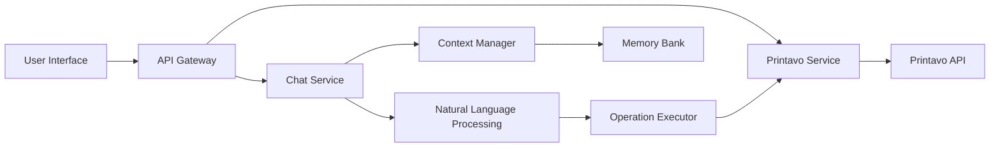

# System Patterns: Printavo Chat Application

**Architecture:**
The Printavo Chat application follows a layered architecture, with distinct components responsible for different aspects of the system.

**Components:**

1.  **User Interface (UI):**
    -   React-based web interface for user interaction.
    -   Handles chat input and output display.
    -   Communicates with the API Gateway.

2.  **API Gateway:**
    -   Next.js API routes for handling requests from the UI.
    -   Routes requests to appropriate backend services.
    -   Handles authentication and authorization.

3.  **Chat Service:**
    -   Core logic for chat functionality.
    -   Manages conversation flow and state.
    -   Integrates with NLP and Context Manager.

4.  **Natural Language Processing (NLP):**
    -   OpenAI API for natural language understanding.
    -   Processes user messages to identify intent and extract parameters.
    -   Translates natural language queries into structured operations.

5.  **Context Manager:**
    -   Manages conversation context and history.
    -   Stores and retrieves relevant context for each conversation.
    -   Improves NLP accuracy by providing context.

6.  **Printavo Service:**
    -   Abstraction layer for interacting with the Printavo API.
    -   Encapsulates Printavo API calls and data handling.
    -   Provides functions for common Printavo operations.

7.  **Operation Executor:**
    -   Executes operations based on NLP output.
    -   Calls Printavo Service to perform actions.
    -   Formats responses for the Chat Service.

8.  **Memory Bank:**
    -   Stores project-related documentation and context.
    -   Provides persistent storage for system knowledge.
    -   Used for documentation and context retrieval.

**Design Patterns:**

-   **API Gateway:** Central point of entry for all API requests.
-   **Backend for Frontend (BFF):** API Gateway tailored for the UI needs.
-   **Service Abstraction:** Printavo Service isolates the application from Printavo API specifics.
-   **Strategy Pattern:** Operation Executor uses different strategies for different operations.
-   **Context Pattern:** Context Manager provides conversational context to NLP and other services.

**Key Technical Decisions:**

-   **Next.js:** Full-stack framework for UI and API development.
-   **OpenAI API:** NLP engine for natural language understanding.
-   **Printavo API:** Integration with Printavo for data access.
-   **TypeScript:** Language for type safety and maintainability.
-   **Markdown:** Format for memory bank documentation.
