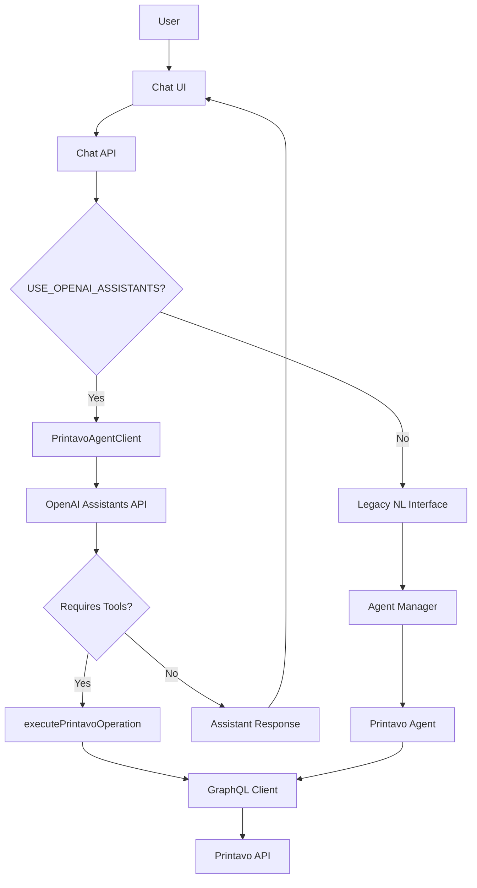

# Technical Context: Printavo Chat Application

**Technologies Used:**

-   **Frontend:**
    -   React: JavaScript library for building user interfaces.
    -   Next.js: React framework for full-stack web applications.
    -   Tailwind CSS: Utility-first CSS framework.
    -   TypeScript: Superset of JavaScript that adds static typing.

-   **Backend:**
    -   Next.js API routes (Node.js): Server-side logic and API endpoints.
    -   OpenAI API: Natural language processing and language model.
    -   Printavo API: REST and GraphQL API for accessing Printavo data.
    -   GraphQL Client: Apollo Client or similar for querying Printavo GraphQL API.

-   **Development Tools:**
    -   VSCode: Integrated development environment.
    -   npm: Package manager for JavaScript dependencies.
    -   Git: Version control system.
    -   Jest: JavaScript testing framework.

-   **Agent Technology (Planned):**
    -   OpenAI Agents SDK: Framework for creating autonomous agents.
    -   Agent Function Calling: Method for structured tool use by AI models.
    -   Agent Memory: Persistent storage for maintaining context.
    -   Agent Orchestration: Coordination between multiple specialized agents.

**Development Setup:**

1.  **Prerequisites:**
    -   Node.js and npm installed.
    -   Printavo API credentials (Email, Token, API URL).
    -   OpenAI API key.
    -   Git installed.

2.  **Project Setup:**
    ```bash
    git clone [repository-url]
    cd printavo-chat
    npm install
    ```

3.  **Environment Variables:**
    -   Create `.env.local` file in the project root.
    -   Add the following environment variables:
        ```
        NEXT_PUBLIC_PRINTAVO_API_URL=https://www.printavo.com/api/v2
        NEXT_PUBLIC_PRINTAVO_EMAIL=your_printavo_email
        NEXT_PUBLIC_PRINTAVO_TOKEN=your_printavo_token
        OPENAI_API_KEY=your_openai_api_key
        ```

4.  **Running the Application:**
    ```bash
    npm run dev
    ```
    -   Frontend will be accessible at `http://localhost:3000`.
    -   Backend API routes will be accessible at `http://localhost:3000/api`.

**Printavo API Integration:**

-   **Authentication:**
    -   Printavo API uses email/token authentication instead of Bearer tokens.
    -   Headers must include `email` and `token` fields with appropriate values.
    -   Make sure environment variables are correctly set.

-   **API Endpoints:**
    -   GraphQL endpoint: `${PRINTAVO_API_URL}/graphql`
    -   REST endpoints: Various endpoints under the base API URL

-   **Error Handling:**
    -   Custom error types created for different API error scenarios.
    -   Retry logic implemented for transient network issues.
    -   Rate limiting protection with exponential backoff.

-   **Debugging:**
    -   Health check endpoint available at `/api/health`.
    -   Comprehensive logging throughout the API client code.
    -   Error response analysis to determine the nature of failures.

**API Layer:**
- **EnhancedAPIClient:**
  - Intelligent request queuing
  - Rate limit handling
  - Request staggering
  - Exponential backoff
  - TTL-based caching
  - Fallback mechanisms
  - Error recovery
  - Comprehensive logging

- **API Services:**
  - OrdersAPI: Order management operations
  - QuotesAPI: Quote and invoice operations
  - StatusesAPI: Status management operations
  - Each service implements:
    - Proper error handling
    - Type safety
    - Request validation
    - Response normalization

- **Request Queue:**
  - Manages API request flow
  - Prevents rate limiting
  - Implements staggered requests
  - Handles retries with exponential backoff
  - Respects API rate limits
  - Optimizes request patterns

- **Cache Layer:**
  - TTL-based caching
  - Memory optimization
  - Cache invalidation
  - Request deduplication
  - Response normalization

- **Error Handling:**
  - Specific error types for different scenarios
  - Retry strategies
  - Fallback mechanisms
  - Comprehensive logging
  - User-friendly error messages

**Technical Constraints:**
- **API Rate Limits:**
  - Implemented request queuing and staggering
  - Added exponential backoff for retries
  - Enhanced caching to reduce API calls
  - Added request deduplication
- **Data Consistency:**
  - Proper cache invalidation
  - Response normalization
  - Type safety across services
- **Error Recovery:**
  - Multiple fallback mechanisms
  - Intelligent retry logic
  - Comprehensive error tracking
- **MCP Server Limitations:**
  - Currently using Model Context Protocol servers for external integrations
  - Planning migration to OpenAI Agents SDK for improved reliability and maintenance
  - Will phase out MCP servers completely within 6 weeks

**Dependencies:**

-   **npm packages:** Refer to `package.json` for a complete list of dependencies.
    -   `react`, `react-dom`, `next`, `tailwindcss`, `openai`, `axios`, `graphql-request`, etc.

**Further Considerations:**

-   **Scalability:** Consider scalability requirements for handling a large number of users and concurrent requests.
-   **Monitoring and Logging:** Implement robust monitoring and logging to track application health and debug issues.
-   **Testing:** Write comprehensive unit and integration tests to ensure code quality and prevent regressions.
-   **Deployment:** Define deployment strategy and environment (e.g., Vercel, AWS, Docker).

## MCP Servers (Model Context Protocol)

MCP servers extend Cline's capabilities by providing specialized tools and access to external APIs or systems.

### Supabase MCP Server (`github.com/alexander-zuev/supabase-mcp-server`)
- **Purpose:** Provides tools to interact with the project's Supabase database and management API.
- **Location:** Installed via executable (`C:\Users\King\.local\bin\supabase-mcp-server.exe`).
- **Technology:** Rust, `@modelcontextprotocol/sdk`.
- **Setup:** Configured in `cline_mcp_settings.json` with Supabase project details.
- **Status:** Installed and running.

### SanMar MCP Server (`sanmar-mcp-server`)
- **Purpose:** Provides tools to interact with the SanMar API (both Standard and PromoStandards) via SOAP.
- **Location:** `c:/Users/King/Downloads/print/sanmar-mcp-server/` (Copied into project)
- **Technology:** Node.js, `soap` package, `@modelcontextprotocol/sdk`.
- **Setup:** Configured in `cline_mcp_settings.json` with SanMar credentials, pointing to the project directory.
- **Status:** Installed and running from project directory. Provides a wide range of tools.

### SanMar FTP MCP Server (`sanmar-ftp-mcp-server`)
- **Purpose:** Downloads files from the SanMar FTP server.
- **Location:** `c:/Users/King/Downloads/print/sanmar-ftp-mcp-server/` (Copied into project)
- **Technology:** Node.js, `ssh2` package, `@modelcontextprotocol/sdk`.
- **Setup:** Configured in `cline_mcp_settings.json`, pointing to the project directory.
- **Status:** Installed and running from project directory.

### Printavo GraphQL MCP Server (`printavo-graphql-mcp-server`)
- **Purpose:** Provides tools to interact directly with the Printavo GraphQL API (v2).
- **Location:** `c:/Users/King/Downloads/print/printavo-graphql-mcp-server/` (Copied into project, original deleted)
- **Technology:** Node.js, `@modelcontextprotocol/sdk`. Uses `fetch` internally for API calls.
- **Setup:** Configured in `cline_mcp_settings.json` with Printavo API URL, email, and token, pointing to the project directory.
- **Status:** Installed and running from project directory.
- **Documentation:** See `memory-bank/printavo-mcp-server.md` for details on tools and usage.
- **Integration:** The main application can optionally use this server via `lib/printavo-mcp-client.ts`, controlled by the `USE_PRINTAVO_MCP` environment variable.

## OpenAI Assistants API Integration

We've integrated the official OpenAI Assistants API to replace our custom agent implementation. This approach offers several technical advantages:

### Technical Components:

1. **OpenAI Assistants API:**
   - **Purpose:** Provides a more reliable and contextual interface for natural language interactions
   - **Implementation:** `agents/printavo-assistant.ts` manages Assistant creation and tool registration
   - **Benefits:** Thread management, built-in memory, and more reliable function calling

2. **Thread Management:**
   - **Purpose:** Maintains conversation context across multiple interactions
   - **Implementation:** `agents/agent-client.ts` handles thread creation and message management
   - **Technical Details:** Uses `openai.beta.threads.create()` and related endpoints

3. **Tool Definitions:**
   - **Purpose:** Defines functions that the Assistant can call to interact with Printavo
   - **Format:** JSONSchema-compatible function definitions with parameters
   - **Execution:** `executePrintavoOperation()` converts tool calls to GraphQL queries

4. **Environment Configuration:**
   - **Variables:** 
     - `USE_OPENAI_ASSISTANTS=true` - Enables the Assistants API integration
     - `PRINTAVO_ASSISTANT_ID` - Stores the ID of the created Assistant for reuse
   - **Implementation:** Both `.env` and `.env.local` files store these variables

### Technical Architecture:



### Technical Considerations:

1. **Backward Compatibility:**
   - The system maintains backward compatibility with the existing custom agent implementation
   - Controlled via an environment variable for easy toggling
   - Allows for A/B testing and gradual migration

2. **Thread Persistence:**
   - Thread IDs can be stored in the frontend to maintain conversations across sessions
   - Response payloads include the thread ID for client-side storage

3. **Error Handling:**
   - Comprehensive error handling for tool execution failures
   - Graceful fallbacks when API calls encounter issues
   - Detailed logging for troubleshooting

4. **Rate Limiting:**
   - Consideration for OpenAI API rate limits
   - Proper handling of "requires_action" states during Assistant runs
   - Polling with appropriate timeouts for run completion

5. **Development Environment:**
   - Git Bash command formatting issues addressed by adding Node.js to PATH
   - PowerShell or CMD recommended for Windows users for more reliable command execution
   - Path manipulation for cross-platform compatibility

6. **Future Technical Considerations:**
   - Potential integration with dashboard components for data retrieval
   - Analytics implementation for tracking Assistant performance
   - Caching strategies for frequently used Assistant responses

This implementation represents a significant technical advancement over our custom agent system, leveraging OpenAI's purpose-built infrastructure for more reliable and contextual AI interactions.
